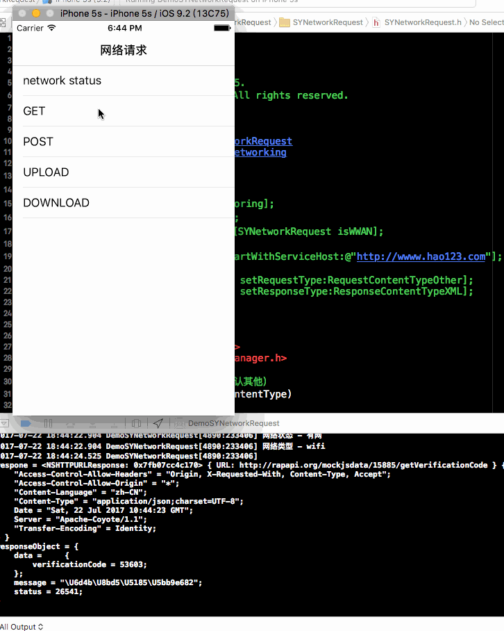

# SYNetworkRequest
网络请求封装

效果图




使用介绍
* 自动导入：使用命令pod `SYNetworkRequest` 导入到项目中
* 手动导入：或下载源码后，将源码添加到项目中（注意：需要添加AFNetworking）


使用注意事项
* 网络状态
  * 监测：
    * [SYNetworkRequest networkMonitoring];
    * [SYNetworkRequest netWorkReachability:nil];
  * 状态：[SYNetworkRequest isReachable];
  * 类型：[SYNetworkRequest isWIFI]; 或 [SYNetworkRequest isWWAN];

* 初始化服务器地址：[SYNetworkRequest startWithServiceHost:@"http://wwww.hao123.com"];

// [[SYNetworkRequest shareRequest] setRequestType:RequestContentTypeOther];
// [[SYNetworkRequest shareRequest] setResponseType:ResponseContentTypeXML];

### 使用示例
~~~ javascript
#import "SYNetworkRequest.h"
~~~

~~~ javascript
- (BOOL)application:(UIApplication *)application didFinishLaunchingWithOptions:(NSDictionary *)launchOptions {
    // Override point for customization after application launch.

    // 网络环境监测
    [SYNetworkRequest networkMonitoring];
    [SYNetworkRequest netWorkReachability:nil];

    [SYNetworkRequest startWithServiceHost:@"http://wwww.hao123.com"];
    // [[SYNetworkRequest shareRequest] setRequestType:RequestContentTypeOther];
    // [[SYNetworkRequest shareRequest] setResponseType:ResponseContentTypeXML];


    return YES;
}
~~~ 

~~~ javascript
BOOL isStatus = [SYNetworkRequest isReachable];
NSLog(@"网络状态 - %@", (isStatus ? @"有网" : @"无网"));
BOOL isWIFI = [SYNetworkRequest isWIFI];
BOOL isWWAN = [SYNetworkRequest isWWAN];
NSLog(@"网络类型 - %@", (isWIFI ? @"wifi" : (isWWAN ? @"wwan" : @"unknow")));
~~~ 

~~~ javascript
// GET
NSString *url = @"http://rapapi.org/mockjsdata/15885/getUserInfo";

NSURLSessionDataTask *dataTask = [[SYNetworkRequest shareRequest] requestWithUrl:url parameters:nil methord:@"GET" uploadProgress:^(NSProgress *progress) {
    NSLog(@"\nupload progress = %@", @(progress.fractionCompleted));
} downloadProgress:^(NSProgress *progress) {
    NSLog(@"\ndownload progress = %@", @(progress.fractionCompleted));
} complete:^(NSURLResponse *response, id responseObject, NSError *error) {
    NSLog(@"\nrespone = %@\nresponseObject = %@\n", response, responseObject);
}];
[dataTask resume];
~~~ 

~~~ javascript
// POST
NSString *url = @"http://rapapi.org/mockjsdata/15885/getVerificationCode";
NSDictionary *dict = @{@"phoneNumber":@(13800138000), @"timeStamp":@(456461015645646)};

NSURLSessionDataTask *dataTask = [[SYNetworkRequest shareRequest] requestWithUrl:url parameters:dict methord:@"post" uploadProgress:^(NSProgress *progress) {
    NSLog(@"\nupload progress = %@", @(progress.fractionCompleted));
} downloadProgress:^(NSProgress *progress) {
    NSLog(@"\ndownload progress = %@", @(progress.fractionCompleted));
} complete:^(NSURLResponse *response, id responseObject, NSError *error) {
    NSLog(@"\nrespone = %@\nresponseObject = %@\n", response, responseObject);
}];
[dataTask resume];
~~~ 

~~~ javascript
// UPLOAD

~~~ 

~~~ javascript
// DOWNLOAD
NSString *url = @"http://img4.duitang.com/uploads/item/201210/24/20121024114802_sVwSR.jpeg";
NSURLSessionDownloadTask *dataTask = [[SYNetworkRequest shareRequest] requestDownloadWithUrl:url parameters:nil downloadProgress:^(NSProgress *uploadProgress) {
NSLog(@"\ndownload progress = %@", @(uploadProgress.fractionCompleted));
} complete:^(NSURLResponse *response, NSURL *filePath, NSError *error) {
NSLog(@"\nrespone = %@\nfilePath = %@\n", response, filePath);
}];
[dataTask resume];
~~~ 

### 管理网络请求
~~~ javascript
// 添加管理
NSURLSessionDataTask *dataTask = [[SYNetworkRequest shareRequest]...;
[SYNetworkRequest.shareRequest addRequest:dataTask];
~~~ 

~~~ javascript
// 取消某个请求
NSString *url = @"http://rapapi.org/mockjsdata/15885/getVerificationCode";
[SYNetworkRequest.shareRequest cancelRequest:url];
~~~ 

~~~ javascript
// 取消全部请求
[SYNetworkRequest.shareRequest cancelAllRequest];
~~~ 


# 修改完善
* 20191106
  * 版本号：1.3.5
  * 修改优化
    * 添加请求超时参数
    * 添加请求管理方法

* 20181116
  * 版本号：1.3.4
  * 修改完善
  
* 20180528
  * 版本号：1.3.3
  * 代码优化
  
* 20180131
  * 版本号：1.3.2
  * 添加网络状态变化处理
    * 有无网络时发出通知
    * 用户自定义接收网络状态变化通知，并执行相应方法

```
[[NSNotificationCenter defaultCenter] postNotificationName:kNotificationNameUnReachable object:nil];
// 没有网络状态通知
[[NSNotificationCenter defaultCenter] receiveNotificationWithName:kNotificationNameUnReachable target:self selector:@selector(networkUnReachability:)];
- (void)networkUnReachability:(NSNotification *)notification
{ }
```
```
[[NSNotificationCenter defaultCenter] postNotificationName:kNotificationNameReachable object:nil];
// 有网络状态通知
[[NSNotificationCenter defaultCenter] receiveNotificationWithName:kNotificationNameReachable target:self selector:@selector(networkReachability:)];
- (void)networkReachability:(NSNotification *)notification
{ }
```


* 20170925
  * 版本号：1.3.1
  * 添加https请求

* 20170912
  * 版本号：1.2.0
  * 文件下载请求添加请求参数及请求方式
  * 缓存枚举类型重命名
    * NetworkCacheType修改成RequestCacheType
    * NetworkCacheTime修改成RequestCacheTime
  * 添加网络异常处理判断
    * 网络正常
    * 外网异常
    * 外网异常且无缓存
    * 外网异常且有缓存
    * 服务器异常
    * 服务器异常且无缓存
    * 服务器异常且有缓存

* 20170801
  * 修改上传文件方法
  * 添加版本号1.1.2

* 20170725
  * 修改baseUrl初始化异常
~~~ javascript
NSURL *baseUrl = self.hostUrl;
if (![baseUrl.scheme isEqualToString:@"http"] && ![baseUrl.scheme isEqualToString:@"https"])
{
    baseUrl = [NSURL URLWithString:[NSString stringWithFormat:@"http://%@", APIServiceHost]];
}
~~~

* 20170724 
  * 版本更新1.1.0
    * 添加更加请求方式
    * 初始化请求格式、返回格式
    * 新建文件SYNetworkAFHTTPSessionManager.h
~~~ javascript
/// 请求类型（POST、GET）
typedef NS_ENUM(NSInteger, RequestHttpType)
{
    /// 请求样式-POST
    RequestHttpTypePOST = 1,

    /// 请求样式-GET
    RequestHttpTypeGET = 2,

    /// 请求样式-PUT
    RequestHttpTypePUT = 3,

    /// 请求样式-DELETE
    RequestHttpTypeDELETE = 4,

    /// 请求样式-HEAD
    RequestHttpTypeHEAD = 5,

    /// 请求样式-PATCH
    RequestHttpTypePATCH = 6,
};
~~~
~~~ javascript
// 初始化请求格式、返回格式
self.responseType = ResponseContentTypeOther;
self.requestType = RequestContentTypeOther;
~~~


